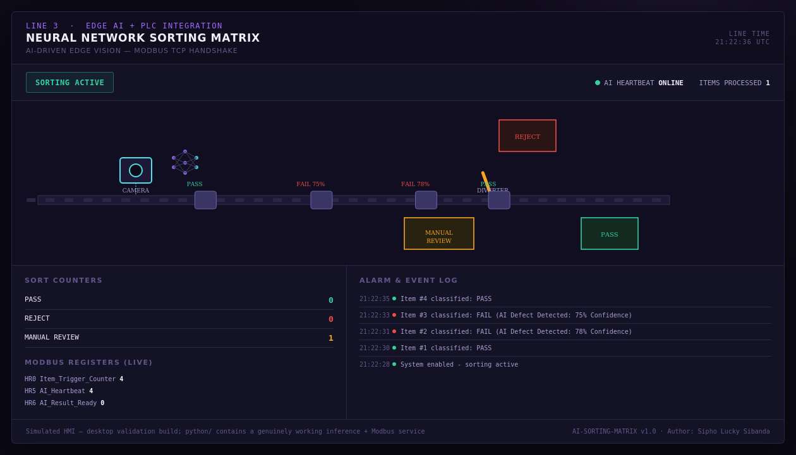
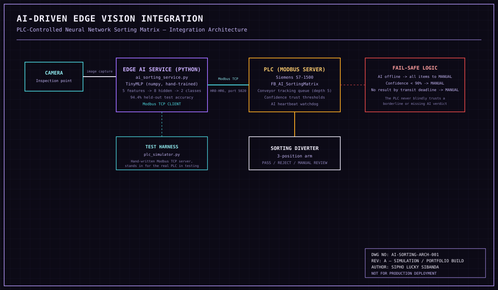

# 🤖 AI-Driven Edge Vision Integration
### PLC-Controlled Neural Network Sorting Matrix

👁Live Project

### 🖥️ Interactive HMI

╰┈➤[Launch the AI-Driven HMI](https://hangmanlucky.github.io/ai-vision-sorting/)


**Author:** Sipho Lucky Sibanda
**Series:** Automation Skills Portfolio — Applied Artificial Intelligence
(a third discipline shift — the same PLC engineering discipline meeting a real, working Python/ML edge service)

---

## 🤖 Context — Why This Matters

A standard industrial PLC cannot run a neural network. It doesn't need to — it needs
to talk to something that can, receive a trustworthy answer, and act on it physically
and safely. This project simulates exactly that integration: a Python edge service
running a real trained model inspects items on a conveyor, and a PLC decides whether
to actually believe the verdict before routing the item to a physical sorting lane.

## 🧪 What Makes This Project Different From the Rest of the Portfolio

Every other project in this portfolio can only be validated in simulation, because
there's no real ship, aircraft, or building to test against. **This one can actually
run.** `python/` contains a genuinely trained model and a genuinely working Modbus
TCP client/server pair — not a mockup. The logs in
[`Testing_Procedures.md`](Testing_Procedures.md) are copy-pasted output
from real executions, including a test where the AI service was `SIGKILL`ed mid-run
to prove the PLC-side watchdog actually detects it.

## 🔧 What This Project Does

- **`python/vision_model.py` + `train_model.py`** — a small, honest neural network
  (5 engineered features → 8 hidden units → 2 classes) trained from scratch with
  hand-written numpy backpropagation on synthetic defect-patch data, reaching
  **94.4% held-out test accuracy**
- **`python/ai_sorting_service.py`** — a Modbus TCP *client* that polls for new
  items, runs inference, and writes the verdict back to the PLC's register map —
  the actual "Python-to-PLC handshake"
- **`python/plc_simulator.py`** — a minimal, hand-written Modbus TCP *server*
  standing in for the real PLC during testing (the same role PLCSIM plays for the
  Structured Text projects elsewhere in this portfolio)
- **`src/AI_SortingMatrix.st`** — the real PLC-side logic: tracks items physically
  travelling along the conveyor, applies **conservative confidence thresholds** on
  top of the AI's own verdict, watches an AI heartbeat, and fails safe to manual
  review whenever anything looks uncertain

## 🖥️ HMI — Conveyor & Sorting Visualization

The `index.html` mockup shows items moving along a conveyor, getting labelled
live at the camera station ("PASS" or "FAIL (AI Defect Detected: 78% Confidence)"),
and a diverter arm swinging to route each one into a PASS, REJECT, or MANUAL REVIEW
bin. It scripts an AI-offline event partway through so the fail-safe behaviour is
something you actually see happen.



## 🗺️ System Architecture



## ⚙️ Key Engineering Concepts

| Concept | How it's implemented |
|---|---|
| Honest AI scope | A real, small, trained network — explicitly not claimed to be a production CV pipeline |
| The PLC doesn't trust blindly | A second, stricter confidence threshold on the PLC side, above and beyond the model's own decision boundary |
| Conveyor transport tracking | A depth-5 tracking queue matches each physical item to its eventual AI result by ID, not arrival order |
| AI heartbeat watchdog | Genuinely tested by killing the real Python process, not just forcing a flag |
| Fail-safe default | No result, low confidence, or an offline AI all route to a human — never a guess |

## 🚀 Running It Yourself

```bash
cd python
python3 train_model.py                    # trains and saves model_weights.npz
python3 plc_simulator.py 30 &              # starts the Modbus TCP server for 30s
python3 ai_sorting_service.py 10           # runs the AI client for 10 items
```

## 📁 Repository Structure

```
ai-vision-sorting/
├── README.md
├── src/
│   └── AI_SortingMatrix.st           # IEC 61131-3 Structured Text PLC logic
├── python/
│   ├── vision_model.py               # Feature extraction + hand-written numpy MLP
│   ├── train_model.py                # Trains and saves the model
│   ├── ai_sorting_service.py         # Modbus TCP client (the edge AI service)
│   ├── plc_simulator.py              # Modbus TCP server (test-harness PLC stand-in)
│   └── demo_run_*.log                # Real captured output from genuine test runs
├── docs/
│   ├── IO_List.md                    # Physical I/O + Modbus register map
│   └── Testing_Procedures.md         # FAT-style tests + real executed logs
├── hmi/
│   └── index.html                    # Conveyor / sorting visualization
└── images/
    ├── architecture_diagram.svg      # Integration architecture diagram
    └── hmi-dashboard.png             # Rendered HMI screenshot
```

## 📄 Documentation

- [I/O List &amp; Modbus Register Map](IO_List.md)
- [Functional Test Procedures (with real logs)](Testing_Procedures.md)
- [Full Technical Manual (PDF)](AI_Vision_Technical_Manual.pdf) — 25-page project ebook covering edge-AI industry context, architecture, the neural network's honest scope and real training results, full annotated PLC and Python code, the genuinely executed integration test with real logs, HMI design, testing/commissioning, and a HAZOP-style hazard register

## ⚠️ Disclaimer

This is a **simulation and portfolio project**, though the Python side is genuinely
functional. The neural network is a small, honest demonstration model on synthetic
data — not a production machine-vision system. The PLC-side Structured Text has
been validated in simulation only. Neither has been tested on real manufacturing
hardware.

## 👤 Author

**Sipho Lucky Sibanda**
Automation & Controls Portfolio — Marine, Avionics, Architectural, Applied AI &amp; Industrial Systems

---
